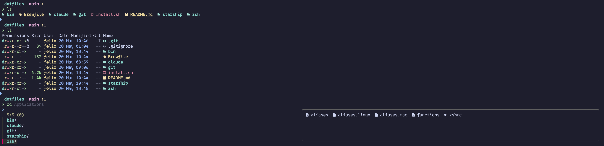

# dotfiles



  

An opinionated terminal setup: beautiful output, zero friction across machines, and pre-made choices so you stop configuring and start working.

## 1. 🧠 Philosophy

> The terminal is not just a black screen. It should be fast, readable, and — honestly — nice to look at. This repo is the full setup I've settled on after iteration: a prompt that shows what I need at a glance, tools that replace noisy defaults with something better, and a single command to reproduce it anywhere.

The decisions are opinionated on purpose. A blank slate takes days to tune. This takes one `./install.sh`.

## 2. ✨ The beautiful magic

The tools below are what make the terminal actually pleasant to be in — not just functional, but something you enjoy looking at.

**Color scheme — Catppuccin or Dracula.** The specific theme depends on your terminal emulator and isn't tracked here, but the palette matters: soft pastels (Catppuccin) or rich contrast (Dracula) make syntax highlighting, diffs, and prompts feel cohesive instead of random. Pick one and apply it everywhere.

**Nerd Font.** A font patched with thousands of icons — folder glyphs, git symbols, language logos. Without it, `eza` and Starship render broken squares. With it, the terminal starts to feel like a proper UI. 0xProto Nerd Font is the one I use.

**[Starship](https://starship.rs).** A cross-shell prompt that shows git branch, dirty state, and context in milliseconds. Written in Rust — it's fast enough that you never notice it. Configured in `starship/starship.toml`.

**[eza](https://eza.rocks).** A modern replacement for `ls` — icons, colors, git status per file, and a tree view. Makes directory browsing actually readable. Aliased to `ls`, `ll`, and `lt`.

**[bat](https://github.com/sharkdp/bat).** A `cat` replacement with syntax highlighting and line numbers. Aliased to `cat` — you get it for free every time you print a file.

**[delta](https://dandavison.github.io/delta/).** Replaces the default git diff pager with side-by-side view, syntax highlighting, and line numbers. Makes reviewing changes actually comfortable.

**[fzf](https://github.com/junegunn/fzf) + fzf-tab.** Fuzzy finder wired into the shell. `fzf-tab` replaces standard tab completion with an interactive visual selector — you see all options at once and filter by typing. One of those things you can't go back from.

## 3. 📦 What's here

```
.dotfiles/
├── zsh/
│   ├── zshrc
│   ├── aliases          # shared across OS
│   ├── aliases.mac
│   ├── aliases.linux
│   └── functions
├── git/
│   └── gitconfig
├── starship/
│   └── starship.toml
├── claude/
│   └── CLAUDE.md
├── bin/
│   └── dotfiles-health
├── assets/
│   └── example.png
├── Brewfile
└── install.sh
```

| Path | Tool | Why |
|------|------|-----|
| `starship/` | [Starship](https://starship.rs) | Cross-shell prompt written in Rust — shows git branch, status, and context instantly, without slowing the shell down |
| `zsh/` | oh-my-zsh + custom aliases | Short aliases for git, Docker, Python, and navigation; shared across OS with mac/linux splits for anything platform-specific |
| `git/` | [delta](https://dandavison.github.io/delta/) | Replaces the default `git diff` pager with side-by-side diffs, line numbers, and syntax highlighting |
| `claude/` | CLAUDE.md | Shared Claude Code config — how I want AI assistance to behave globally |
| `bin/` | `dotfiles-health` | Verify the whole setup is wired up correctly after install |
| `Brewfile` | Homebrew bundle | All macOS dependencies in one place — `brew bundle` installs everything |
| `install.sh` | Bootstrap | Handles Homebrew, oh-my-zsh, zsh plugins, symlinks, and git identity in one run |

Key aliases: `ls` → `eza --icons`, `cat` → `bat`, `ll` → `eza -lah --icons --git`, `gls` → decorated git log graph.

## 4. 🚀 Install it

### 4.1. 🔧 Manual steps (not automated)

**Git identity on a fresh machine** — if no prior gitconfig existed, set your identity:
```sh
git config --file ~/.gitconfig.local user.name "Your Name"
git config --file ~/.gitconfig.local user.email "you@example.com"
```

**Linux Nerd Font** — required for icons in `eza`:
- Download from [nerdfonts.com](https://www.nerdfonts.com) (0xProto Nerd Font recommended)
- Extract to `~/.local/share/fonts/`
- Run `fc-cache -fv`
- Set the font in your terminal preferences

### 4.2. ⚡ Automated

```sh
git clone git@github.com:felhix/.dotfiles.git ~/.dotfiles
cd ~/.dotfiles && ./install.sh
```

Preview without making changes:
```sh
./install.sh --dry-run
```

Verify everything is set up correctly:
```sh
bin/dotfiles-health
```

### 4.3. 💻 Machine-specific config

> [!TIP]
> Put anything machine-specific in `~/.zshrc.local` — sourced automatically, not tracked by git.
